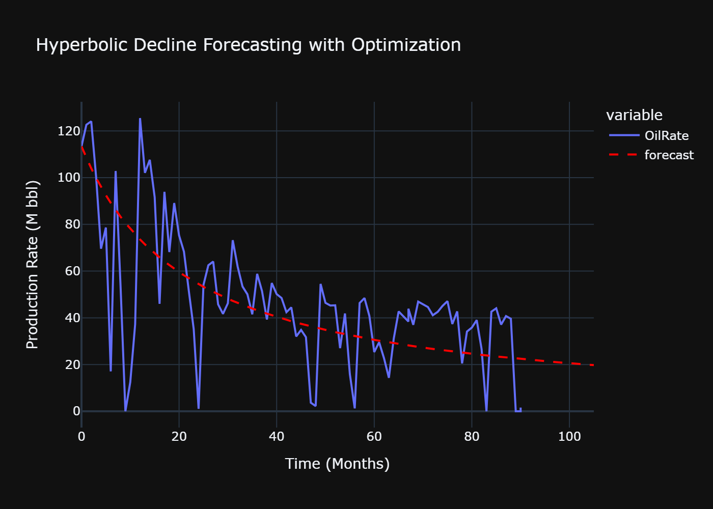
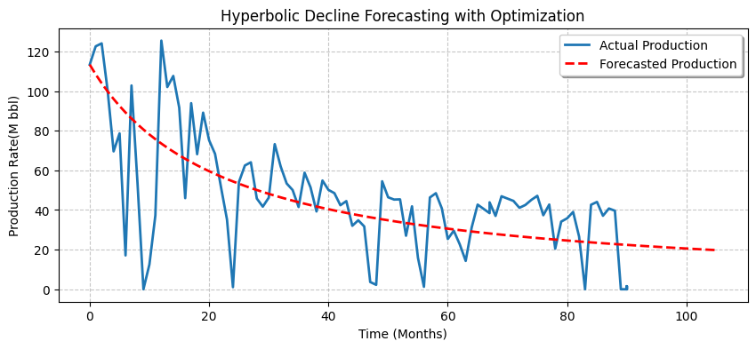

# Automated DCA Forecasting for Oil Wells



This project implements a practical production-engineering DCA workflow: historical oil-rate data are conditioned, a hyperbolic decline model is calibrated with constrained optimization, and the calibrated decline is projected into future months for surveillance-ready forecasting. The notebook is intentionally compact, but the modeling logic is rigorous and reproducible.

## Technical Approach

The decline model used is hyperbolic:

```text
q(t) = Qi / (1 + b * di * t)^(1/b)
```

where `Qi` is initial rate, `di` is initial decline, and `b` controls curvature.  
Given observed rates `q_obs(t_n)`, parameters are fitted by minimizing mean squared error:

```text
min_{b,di} (1/N) * sum_{n=1..N} [ q_obs(t_n) - q(t_n; Qi,b,di) ]^2
```

with bounded search (\(0 < b < 1,\ 0 < d_i < 1\)) using SLSQP (`scipy.optimize.minimize`). This constrained fit is important in production contexts because it limits non-physical parameter drift while preserving computational efficiency on short well-level time series.

## Engineering Logic Behind the Workflow

- Raw field columns are standardized (`Date`, `OilRate`, `GasRate`, `WaterRate`) and ordered in time to enforce chronology before fitting.
- A single well stream is isolated and converted to a monthly index, aligning with decline-based planning horizons.
- Rates are normalized (Mbbl-scale) to stabilize optimization numerics.
- The fitted model is applied over history + a 16-month forward index, creating one continuous dataframe for diagnostics and planning.
- Matplotlib and Plotly views are used together: one for quick QC, one for interactive surveillance communication.



## Dataset and Source

- Expected input file: `data/Buchan_Daily_Production_Data.csv`
- Source context: Buchan field daily production records provided as the project dataset input.
- Distribution note: raw CSV data is intentionally not versioned in this repo; place the file locally under `data/` before running the notebook.

## Run Instructions

```bash
pip install -r requirements.txt
jupyter lab
```

Then open `Notebook3- DCA.ipynb` and run top-to-bottom.

## Credits

Author / Developer: **Destiny Otto**
